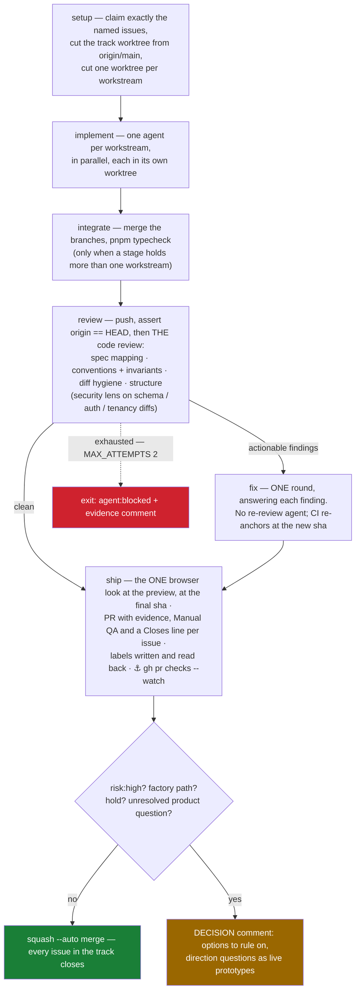

# Agent Delivery OS — the one doctrine page

This is an autonomous software-delivery environment: you hand it work plus specs, it turns each item
into a GitHub Issue, builds it in an isolated worktree, and opens a PR only when the Definition of
Done passes with evidence attached. **You are the product manager** — your manual step is ruling on
decisions and reviewing PRs.

## The contract

1. **CI green is the merge contract.** The `Format, Lint, Typecheck, Build` check — format:check,
   lint, typecheck, test, build — is the verdict. A green anchor at the PR head sha IS the gate;
   never re-derive beside it. Everything an agent reports is a claim.
2. **Exactly ONE code review per PR.** One review site, one reviewer, one fix round. No scoped
   per-workstream reviews, no re-review agent.
3. **Exactly ONE browser look**, at the branch's **Vercel preview** and never `localhost:3000`
   (localhost serves the main checkout, so it never contains the branch's work), at the final sha.
4. **Agents rule for themselves**, and record every ruling. See *Rulings* below.

`risk:high` and factory-path changes (`.claude/workflows/`, the delivery-OS skills, `.cursor/`, `ops/agent-os/`)
never auto-merge — the machine that decides what merges keeps a human. Exhaustion is never a silent
stop: it produces `agent:blocked` plus an evidence comment. Labels are canonical and the Project board
is a one-way mirror of them; exactly one `agent:*` label per active issue.

## The pass graph

A track is a connected component over (shared-file ∪ `dependsOn`) edges: one branch, one worktree, one
PR. That is the throughput argument — a build, a suite, a preview deployment, a CI round trip and a
human's attention are each paid once, whether the track holds one workstream or eight.

## Rulings

An agent rules for itself from `product-docs/product-values.md`, `CONTEXT.md` and
`memory/invariants.md`, and **records the ruling**: product calls in `product-docs/decisions.md`, code
calls in the PR body. For a genuinely hard call, convene a short **consulate** — two or three agent
perspectives on the same question, then one synthesis that decides. A review finding is ruled the same
way: apply it or waive it, and say which. Provenance never enters the code: a source comment states a
constraint the code cannot show, while issue numbers, ruling dates and review rounds live in the
commit message, the PR body and `memory/`.

`needs-spec`, and holding a PR with a DECISION comment, are the **last resort** — reserved for
irreversible calls and the owner's taste. The human queue holds decisions, never "please re-check what
the gates already proved". A **UI direction** question the owner's taste decides escalates as **live
prototypes**, not prose (`.claude/skills/prototype/`): two or three variants behind the switcher on the
preview, and prototype code never merges. Behavior and policy questions are not that class — rule them
yourself from product-values / CONTEXT / invariants and record the ruling.

## What makes work delegable

- **R1 — Design the hard parts before dispatch.** Schema, shared contracts, security boundaries and
  concurrency guards are decided in the issue. Stage 0 *lands* the shared prerequisite and never
  *invents* it mid-build, because a wrong interface there is rework multiplied by the workstream
  count. The agent may rule the interface when it is derivable from the invariants; it escalates only
  when they cannot answer.
- **R2 — One domain, one module, one implementation per decision.** Feature logic lives in
  `src/lib/<domain>/`; a decision is a named exported function that every surface calls, so the UI
  gate and the server gate cannot drift.
- **R3 — Scope issues to outcomes, workstreams to files.** One observable outcome per issue, each AC
  naming how it is proven; the unit that stays small and file-disjoint is the workstream. Dependencies
  are edges, never prose.

The fourth rule needs an anchor of its own, because `memory/invariants.md` and
`product-docs/product-values.md` cite it by name.

## Rules bind at two strengths

R6: the corpus agents read before mutating (`memory/invariants.md`) mixes two strengths, and
delegation needs them told apart:

- **Invariant** — a mechanical or security fact: the stack, the tenant boundary, the auth surface.
  Never broken. An agent that thinks one is wrong is wrong.
- **Ruling (⚖)** — a product decision. Never broken *silently*. An agent that believes a ruling no
  longer fits rules on it per *Rulings* above, records why, and keeps building to the standing ruling
  meanwhile.

This is what keeps recorded decisions from calcifying into false physics: the escalation path is cheap,
so "the rule seems wrong" has somewhere to go other than being ignored or obeyed.

## Invocation

**User-invoked = entry points only. Everything the loop calls stays model-invocable.** The full
contract — issue comments as the orchestrator↔track channel (never `SendMessage`), serialized loop
invocations, stale-claim recovery, and the schema-capable-track heuristic — lives in
`ops/agent-os/invocation.md`. Read that **before dispatching**. The cycle, G5 undeclared-migration
fence, and `agent:changes-requested` re-entry live in `ops/agent-os/workflow.md`.

> **Hazard.** Flagging anything the loop calls with `disable-model-invocation: true` breaks it
> *silently* — the subagent simply cannot see the skill, and the failure surfaces as an unrelated
> gate failure minutes later. Same class of trap as renaming the CI job without updating the
> ruleset: a contract living in two places.

## Where each piece lives

| Piece | File |
|---|---|
| The gate contract | `ops/agent-os/dod.md` |
| Status labels, the board, the frontier query | `ops/agent-os/labels.md` |
| How work enters the loop (channel, serialize, recovery) | `ops/agent-os/invocation.md` |
| The loop cycle, G5 fence, review re-entry | `ops/agent-os/workflow.md` |
| The build loop | `.claude/workflows/build-until-done.js` |
| Planning an FRD into tracks / building the frontier | `.claude/workflows/frd-plan.js`, `.claude/workflows/frd-implement.js` |
| Cursor mirror of the factory | `.cursor/` (skills / agents / commands / workflows symlink here; hooks are native) |
| The reviewer brief | `.claude/agents/code-reviewer.md` |
| Board mirror (labels → columns) | `.github/workflows/board-sync.yml` |
| Intake · dispatch · PR · validation | `.claude/skills/{spec-intake,dispatch,open-pr,validate,browser-validation,definition-of-done}/` |
| Ruling a direction question | `.claude/skills/prototype/` |
| How tradeoffs are decided | `product-docs/product-values.md` |
