# The delivery workflow, on one page

How a sentence ("add X") becomes a merged PR — and where a human is genuinely needed. The
mechanics live in the files linked below; this page is the map. GitHub renders the diagram.

Two principles explain most of the shape:

- **Labels are canonical, everything else is derived.** Agents read and write issue labels;
  the Project board is a one-way mirror of them (`.github/workflows/board-sync.yml`).
- **Anchored, not attested.** Work counts as done when GitHub says so (a green required
  check, a real merge state), never because an agent claims it. The two anchor points are
  marked ⚓ below.

```mermaid
flowchart TD
  subgraph intake ["1 · Intake — a sentence becomes buildable work"]
    A["PM list item / idea"] --> B["spec-intake:<br/>testable ACs · validation plan · risk · likely files"]
    B -->|"build-ready"| C["Issue: agent:queued"]
    B -->|"open question"| D["Issue: needs-spec — waits for a ruling<br/>(direction questions get live prototypes)"]
    D -->|"ruling"| C
  end

  subgraph pass ["2 · A dispatch pass"]
    F["dispatch — one pass over the frontier: unclaimed work,<br/>cut into tracks (connected components over<br/>shared-file ∪ dependsOn), capped on concurrent AGENTS"]
    F --> G{"budget sizing (inline, gate 5):<br/>enough to FINISH?<br/>reserve = the largest WORKSTREAM"}
    G -->|"no"| G2["defer / split — never strand work half-done"]
  end
  C --> F

  subgraph loop ["3 · build-until-done — one track, staged; ≤3 attempts PER WORKSTREAM"]
    G -->|"yes"| I["claim: agent:in-progress<br/>(blast-radius guard: exactly these issues)"]
    I --> J["stage 0 — the shared prerequisite<br/>(schema · contract · shared types), in the track worktree"]
    J --> J2["stage n — file-disjoint workstreams IN PARALLEL,<br/>each in a worktree cut from track HEAD,<br/>built via the unit's RECIPE (default implement-straight)<br/>— one child workflow per attempt —<br/>merged back before stage n+1 starts"]
    J2 --> K1["SCOPED verify, per workstream, in its own worktree:<br/>G0 its own ACs · G2 subset covering its changed files<br/>G5 diff vs ITS declared files<br/>(FAIL, or a dead verifier, blocks the track)<br/>then review-fix: critical+structural findings<br/>→ fix agent, ≤2 rounds"]
    K1 -->|"FAIL → fix goes to THAT workstream (its attempt++)"| J2
    subgraph vas ["verify-and-ship — child workflow, the fixed tail"]
      K["INTEGRATION verify, ONCE, on the track branch:<br/>G1 hermetic build · G2 full suite · G4 memory<br/>G3 functional (real browser, preview deploy) · G6 sign-off<br/>risk:high adds 3 diverse-lens reviewers"]
      K2["G6 review-fix loop ≤2 rounds<br/>(re-push + sha assert before re-review)"]
      M["open-pr: evidence bundle + Manual QA<br/>one PR, Closes every issue in the track<br/>agent:in-review"]
      N{"⚓ required CI check green?"}
    end
    K1 -->|"last stage merged"| K
    K -->|"FAIL: names a workstream → its attempt;<br/>unattributable → track integration attempt"| J2
    K -->|"attempts exhausted"| L["agent:blocked + evidence comment"]
    K -->|"PASS"| K2
    K2 -->|"re-review FAIL → a real gate failure"| J2
    K2 --> M
    M --> N
    N -->|"red → the real failure feeds back"| J2
  end

  subgraph gate ["4 · The auto-merge gate — still verify-and-ship"]
    N -->|"green"| O{"risk:high?<br/>hold: true on any unit?<br/>any spec-question warning?<br/>unresolved findings after 2 rounds?"}
    O -->|"clean pass"| Q["merge agent: squash-merge with --auto<br/>⚓ report GitHub's answer, not its own"]
    O -->|"HOLD"| P["hold agent posts a DECISION —<br/>options to rule on, not a defect report;<br/>direction questions arrive as live prototypes;<br/>unresolved review findings arrive as decisions:<br/>merge as-is / direct a fix / take manually"]
    Q --> R["every issue the track closes → board shows Done"]
  end

  subgraph human ["5 · The human queue — rulings, not code reviews"]
    P --> S["Sebastian rules"]
    L --> T["human decides: tighten the spec,<br/>raise the budget, or take it manually"]
  end
  S -->|"ruling applied (or merge as-is)"| Q

  style N fill:#1a7f37,color:#fff
  style Q fill:#1a7f37,color:#fff
  style P fill:#9a6700,color:#fff
  style L fill:#cf222e,color:#fff
```

## Why the track is staged

A track is a connected component over (shared-file ∪ `dependsOn`) edges — one branch, one worktree,
**one PR**, closing however many issues fall inside it. Stages are topological levels by `dependsOn`;
inside a stage, units sharing a declared file union into one **workstream** (one agent, sequential)
and file-disjoint workstreams run in parallel.

The reason is arithmetic, not elegance. Every track pays a fixed cost regardless of size: a branch, a
hermetic build, a full suite, a preview deployment, a CI round trip, a reviewer, and a PR someone has
to look at. `pnpm build` is repo-wide and G3's preview is created by the push, so neither can be
scoped to part of a branch — one of each is all you can run and all you need. Paying that once for
eight workstreams instead of eight times is the whole change (`product-docs/board-design-2026-07.md`
§13, which has the board measurements that motivated it).

## Why the gate splits the way it does

A **spec-question** warning means the verifier found a question about *what should have been
built* — only a human can answer that, so the PR holds and the comment presents options to
rule on. Everything decidable from the codebase alone is a review **finding** (Critical /
structural / suggestion, per `.claude/agents/code-reviewer.md`), and findings are **fixed in the
same pass, never filed as debt** (RULED 2026-08-10, #399). At both review sites — scoped, per
workstream, and integration G6 — Critical and structural findings route to a fix agent and a
re-review, capped at **2 quality rounds**; every integration round that commits re-runs
push+assert so the preview and PR hold the fixed sha, and once the rounds settle a committed fix
forces a **G3 re-run pinned to the final sha** before HR4/PR — no sha ships whose functional gate
never ran at that sha. The DECISION comment reaches the PR on **both** paths: under auto-merge it
rides the hold comment; on a direct `/deliver` run it is posted on its own. A fix that cannot say what it did about
each finding (`perFinding.addressed`, the per-finding analogue of `rootCauseAddressed`) is
refused without a re-review. On exhaust the track **HOLDs with a DECISION comment** — merge as-is
(rule the finding accepted), direct a named fix (the branch and worktree survive to apply it), or
take it manually — never `agent:blocked`, never merge-with-findings. Suggestions never gate and
never trigger a round. The follow-ups rollup this replaced is gone; `ops/agent-os/labels.md`
records the removal.
`risk:high` (auth/permissions, multi-tenant isolation, payments) never auto-merges, because that is
where a bad merge is unrecoverable. Schema and migrations left that list on 2026-08-13 (#435 —
`dod.md` carries the ruling and its revert condition); the migration proofs they owe are keyed on
the DIFF instead, so HR1–HR3 fire on any tier whose diff touches `src/db/migrations/`.

Two other things never auto-merge, and both arrive as a per-unit **`hold: true`** flag that dispatch
sets on the way in: an issue whose body declares never-auto-merge, and — always — any unit whose files
touch the factory itself (`.claude/workflows/`, the delivery-OS skills, `ops/agent-os/`). A change to
the machine that decides what merges keeps a human, because the thing being changed is the thing that
would otherwise have caught the mistake. A track holds if *any* of its units does, and the loop treats
it exactly like `risk:high`. The flag is per unit on purpose: holding one factory track used to mean
`autoMerge: false` for the entire pass, which stalled every clean track beside it.

The human's attention is the scarcest resource in the system: the queue contains only
decisions, never "please re-check what the gates already proved".

When a spec-question (or a `needs-spec` intake question) is a **direction** question — two or
more plausible answers where trying them beats reading about them — the decision arrives as
**live prototypes**, not prose (`.claude/skills/prototype/`): UI directions as 3–4 variants
behind the floating switcher on the branch's preview deployment, behavior directions as a
throwaway interactive CLI under `prototypes/` that replays the same scenarios through each
candidate. The reviewer operates the options and replies `go with A`, `combine A's <x> with
B's <y>`, or `riff on B`. Prototype code never merges — stripping it is part of applying the
ruling.

## Where each piece lives

| Piece | File |
|---|---|
| Status labels + board structure | `ops/agent-os/labels.md` |
| DoD gates (G0–G6, the scoped/integration split, HR lenses) | `ops/agent-os/dod.md` |
| What makes work delegable (design-first, modularity, seams, rule strengths) | `ops/agent-os/delegation-rules.md` |
| The build loop (guarantee layer: planning, claiming, stages, recipes fan-out, scoped verify, attempt accounting) | `.claude/workflows/build-until-done.js` |
| The fixed verify→ship tail (child workflow) | `.claude/workflows/verify-and-ship.js` |
| Build recipes (strategy layer) + their contract | `.claude/workflows/recipes/`, `ops/agent-os/recipes.md` |
| The reviewer brief (findings bar + fix-in-pass contract) | `.claude/agents/code-reviewer.md` |
| Board mirror (labels → columns, closed → Done) | `.github/workflows/board-sync.yml` |
| Intake, dispatch, PR, validation skills | `.claude/skills/{spec-intake,dispatch,open-pr,browser-validation,definition-of-done}/` |
| Prototyping a direction decision | `.claude/skills/prototype/` (+ `src/components/prototype-switcher.tsx`) |
| Design + decision history | `product-docs/board-design-2026-07.md` |
