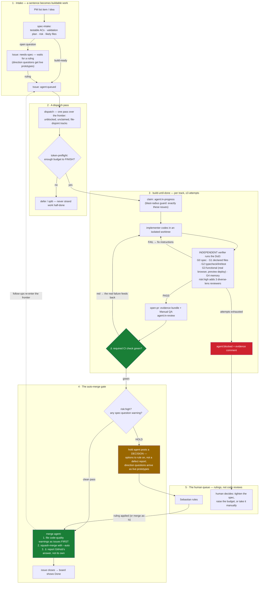

# The delivery workflow, on one page

How a sentence ("add X") becomes a merged PR — and where a human is genuinely needed. The
mechanics live in the files linked below; this page is the map. GitHub renders the diagram.

Two principles explain most of the shape:

- **Labels are canonical, everything else is derived.** Agents read and write issue labels;
  the Project board is a one-way mirror of them (`.github/workflows/board-sync.yml`).
- **Anchored, not attested.** Work counts as done when GitHub says so (a green required
  check, a real merge state), never because an agent claims it. The two anchor points are
  marked ⚓ below.

## Why the gate splits the way it does

A **spec-question** warning means the verifier found a question about *what should have been
built* — only a human can answer that, so the PR holds and the comment presents options to
rule on. A **code-quality** warning is a known, tracked defect — it becomes a queued issue
*before* the merge (so a merge cannot lose it) and re-enters the same loop. `risk:high`
(schema/auth/tenancy) never auto-merges, because that is where a bad merge is unrecoverable.

The human's attention is the scarcest resource in the system: the queue contains only
decisions, never "please re-check what the gates already proved".

When a spec-question (or a `needs-spec` intake question) is a **direction** question — two or
more plausible answers where trying them beats reading about them — the decision arrives as
**live prototypes**, not prose (`.claude/skills/prototype/`): UI directions as 3–4 variants
behind the floating switcher on the branch's preview deployment, behavior directions as a
throwaway interactive CLI under `prototypes/` that replays the same scenarios through each
candidate. The reviewer operates the options and replies `go with A`, `combine A's <x> with
B's <y>`, or `riff on B`. Prototype code never merges — stripping it is part of applying the
ruling.

## Where each piece lives

| Piece | File |
|---|---|
| Status labels + board structure | `ops/agent-os/labels.md` |
| DoD gates (G0–G4, HR lenses) | `ops/agent-os/dod.md` |
| The build loop + auto-merge gate | `.claude/workflows/build-until-done.js` |
| Board mirror (labels → columns, closed → Done) | `.github/workflows/board-sync.yml` |
| Intake, dispatch, PR, validation skills | `.claude/skills/{spec-intake,dispatch,open-pr,browser-validation,definition-of-done}/` |
| Prototyping a direction decision | `.claude/skills/prototype/` (+ `src/components/prototype-switcher.tsx`) |
| Design + decision history | `product-docs/board-design-2026-07.md` |
