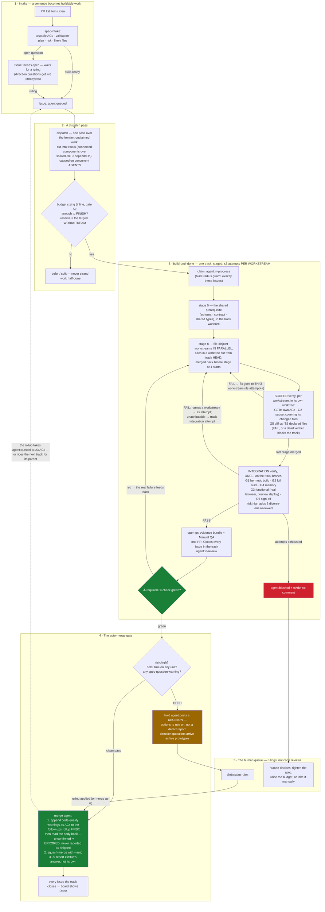

# The delivery workflow, on one page

How a sentence ("add X") becomes a merged PR — and where a human is genuinely needed. The
mechanics live in the files linked below; this page is the map. GitHub renders the diagram.

Two principles explain most of the shape:

- **Labels are canonical, everything else is derived.** Agents read and write issue labels;
  the Project board is a one-way mirror of them (`.github/workflows/board-sync.yml`).
- **Anchored, not attested.** Work counts as done when GitHub says so (a green required
  check, a real merge state), never because an agent claims it. The two anchor points are
  marked ⚓ below.

## Why the track is staged

A track is a connected component over (shared-file ∪ `dependsOn`) edges — one branch, one worktree,
**one PR**, closing however many issues fall inside it. Stages are topological levels by `dependsOn`;
inside a stage, units sharing a declared file union into one **workstream** (one agent, sequential)
and file-disjoint workstreams run in parallel.

The reason is arithmetic, not elegance. Every track pays a fixed cost regardless of size: a branch, a
hermetic build, a full suite, a preview deployment, a CI round trip, a reviewer, and a PR someone has
to look at. `pnpm build` is repo-wide and G3's preview is created by the push, so neither can be
scoped to part of a branch — one of each is all you can run and all you need. Paying that once for
eight workstreams instead of eight times is the whole change (`product-docs/board-design-2026-07.md`
§13, which has the board measurements that motivated it).

## Why the gate splits the way it does

A **spec-question** warning means the verifier found a question about *what should have been
built* — only a human can answer that, so the PR holds and the comment presents options to
rule on. A **code-quality** warning is a known, tracked defect — it is appended as an unchecked AC to
the feature parent's one **`Follow-ups — <parent title>`** rollup issue, still *before* the merge, so
a merge cannot lose it. Only the destination changed: filing one issue per warning put 12 one-file
fixes on the board, each demanding its own branch, build, suite, preview, CI wait and human-facing
PR. The append is then **read back** and every appended line asserted present; if that cannot be
confirmed the track is **ERRORED**, not reported as shipped — the same discipline as `open-pr`'s label
read-back, and for the same reason, which is that on 2026-07-26 the narrative landed while the record
silently did not on 2 of 8 tracks. The rollup takes `agent:queued` once it holds **3 or more**
follow-up ACs, and joins the next track dispatched for its parent regardless of count.
`risk:high` (schema/auth/tenancy) never auto-merges, because that is where a bad merge is
unrecoverable.

Two other things never auto-merge, and both arrive as a per-unit **`hold: true`** flag that dispatch
sets on the way in: an issue whose body declares never-auto-merge, and — always — any unit whose files
touch the factory itself (`.claude/workflows/`, the delivery-OS skills, `ops/agent-os/`). A change to
the machine that decides what merges keeps a human, because the thing being changed is the thing that
would otherwise have caught the mistake. A track holds if *any* of its units does, and the loop treats
it exactly like `risk:high`. The flag is per unit on purpose: holding one factory track used to mean
`autoMerge: false` for the entire pass, which stalled every clean track beside it.

The human's attention is the scarcest resource in the system: the queue contains only
decisions, never "please re-check what the gates already proved".

When a spec-question (or a `needs-spec` intake question) is a **direction** question — two or
more plausible answers where trying them beats reading about them — the decision arrives as
**live prototypes**, not prose (`.claude/skills/prototype/`): UI directions as 3–4 variants
behind the floating switcher on the branch's preview deployment, behavior directions as a
throwaway interactive CLI under `prototypes/` that replays the same scenarios through each
candidate. The reviewer operates the options and replies `go with A`, `combine A's <x> with
B's <y>`, or `riff on B`. Prototype code never merges — stripping it is part of applying the
ruling.

## Where each piece lives

| Piece | File |
|---|---|
| Status labels + board structure | `ops/agent-os/labels.md` |
| DoD gates (G0–G6, the scoped/integration split, HR lenses) | `ops/agent-os/dod.md` |
| The build loop + auto-merge gate | `.claude/workflows/build-until-done.js` |
| Board mirror (labels → columns, closed → Done) | `.github/workflows/board-sync.yml` |
| Intake, dispatch, PR, validation skills | `.claude/skills/{spec-intake,dispatch,open-pr,browser-validation,definition-of-done}/` |
| Prototyping a direction decision | `.claude/skills/prototype/` (+ `src/components/prototype-switcher.tsx`) |
| Design + decision history | `product-docs/board-design-2026-07.md` |
