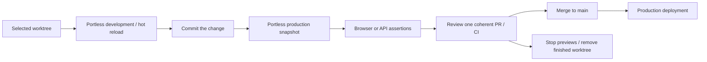

# Local previews and validation

Portless runs the selected Git worktree on a distinct local URL. Use development mode while
editing, then production mode to validate a clean committed snapshot. Creating or updating a PR
is separate from starting a preview. CI still runs the repository checks before merge.



## Install once, configure per project

The managed commands come from our fork in `~/dev/portless`, not the upstream npm package.
Node 24+ and the `portless` launcher must be on PATH. Check `portless preview --help`. The reusable
skill is installed in `.agents/skills/portless-preview/`; Claude and Cursor link to that same copy.
For another project, run `portless preview skill install --project /absolute/project`, or use
`--global` for your Codex installation. Update the managed copy through the installer. EveryField
requirements belong in this document, not a fork of the generic skill.

There is no checked-in, automatically safe EveryField environment. Copy the example below to a
private file outside the worktree, replace placeholders, and pass it explicitly with `--config`.
`.preview.local.json` is also ignored, but a file inside a removed worktree will be deleted.
The commands are argv arrays. Keep processes in the foreground and let Portless allocate `PORT`.

```json
{
  "install": ["pnpm", "install", "--frozen-lockfile"],
  "dev": ["pnpm", "exec", "next", "dev", "--hostname", "127.0.0.1"],
  "build": ["pnpm", "exec", "next", "build"],
  "start": ["pnpm", "exec", "next", "start", "--hostname", "127.0.0.1"],
  "env": {
    "NEXT_TELEMETRY_DISABLED": "1",
    "NEXT_PUBLIC_APP_URL": "${PREVIEW_URL}",
    "DATABASE_URL": "<connection to this preview's disposable Neon database>",
    "RESEND_API_KEY": "<credential for an owned capture-only service>",
    "RESEND_BASE_URL": "<verified capture-only service URL>"
  },
  "healthPath": "/login",
  "healthStatus": 200,
  "timeoutSeconds": 600
}
```

This is a configuration template, not provisioned infrastructure. Add feature-specific variables
from `.env.example` deliberately. Mail flows may also require a fixture sender and a private
`UNSUBSCRIBE_TOKEN_SECRET`. Omit production credentials, scheduler tokens, feedback GitHub tokens,
Sentry upload tokens and unrelated integrations. Do not paste configuration or secrets into PRs.

## Own the data and side effects

Portless's SQLite registry tracks processes, leases and cleanup; it is not the application's
Postgres database. The current application uses Neon's HTTP driver. Use an explicitly owned
disposable Neon database for now. The local Postgres/HTTP proxy in `scripts/live-db-stack.sh`
is wired into test runners, not the Next.js application. A full local application database and
mail provisioning adapter remains separate work; do not claim it exists or silently fall back
to the shared database.

Worktrees initially inherit `.env.local` from the main checkout: shell creation links it, while
Codex-managed creation copies it. Before development mode, replace that link or copied file in
the selected worktree with a private preview-specific file, or remove it and supply every required
value in the private config. Do not edit through a link back to the main checkout.
Inspect any other `.env*` files that Next may load. Explicit environment values take priority, but
omitted values can still come from files. Production snapshots omit ignored/untracked env files;
Portless forwards only its small host allowlist plus the configuration's explicit `env` values.

Apply migrations with `pnpm db:migrate` and seed against that disposable database using its private
environment. Migrations and fixtures are not run automatically by this template. Never reset,
re-key or seed a shared database to satisfy a preview. For email tests, verify that the server-side
transport captures messages and cannot deliver externally; a dummy API key or browser interception
is not isolation. Configure scratch storage when exercising uploads. Keep scheduled work disabled.

If provisioning resources automatically, use Portless `setup` plus an idempotent `teardown`.
Record owned resource IDs before creating them. If resources are provisioned manually, record
ownership and remove them separately after review. `down` cannot delete an external database or
capture service that the config never taught it to own.

## Iterate and prove

```sh
portless preview up --project /absolute/worktree --mode development --config /absolute/private.json --json
# After committing the final change and making the worktree clean:
portless preview up --project /absolute/worktree --mode production --config /absolute/private.json --json
portless preview status --json
portless preview logs PREVIEW_ID
```

Open the exact returned URL, normally `https://<name>.localhost:1355`. It is local to this computer.
Use `portless preview trust` for the local CA when needed. Do not use another checkout's server
or a direct backend port as branch evidence. The generic skill documents explicit HTTP test mode.

Record ID, URL, mode, SHA, acceptance assertions and evidence location. Production mode requires a
clean committed checkout and uses its own dependencies and build output. Changes after validation
need a fresh snapshot and affected assertions repeated. Use the browser-validation skill for UI,
and validate for API/data checks. Readiness is not a feature test. Documentation-only changes need
relevant document/config checks, not an app deployment.

A handoff includes the worktree, commit, preview identity, custom supervisor settings, private
config location, acceptance criteria, evidence and cleanup owner. Default leases last one hour;
use `portless preview renew PREVIEW_ID --ttl 7200` for a bounded review window. Keep pins exceptional
and explicitly remove them when finished. Describe expired/removed URLs honestly in the PR body.

## Finish and verify cleanup

Close the browser tabs/contexts created for the test. Save evidence outside the worktree. Stop
previews when nobody needs them; on the final preview, remove the source worktree when its changes
are committed and all agents/reviewers are finished:

```sh
portless preview down FIRST_PREVIEW_ID
portless preview down LAST_PREVIEW_ID --remove-worktree
portless preview status --json
portless preview gc
```

Ordinary `down` preserves the worktree and borrowed dependencies. Explicit worktree removal also
removes its ignored files, dependencies and build output, but retains its Git branch. The CLI
refuses the main checkout, dirty/detached/changed-HEAD worktrees and concurrent previews. Do not
force-delete past a refusal. A commit made after a development preview started changes its HEAD;
stop that preview and use a preview registered at the final commit for worktree removal.

Verify terminal status, the URL no longer serving the app, and removal from both disk and
`git worktree list`. `cleanup_pending` is not success: fix the cause and retry. `gc` only previews
cleanup until `--apply` is passed. Portless retains bounded per-preview logs/registry history and
does not prune the global pnpm store. Remove manually provisioned external resources separately.

## Deployment and PR policy

The Vercel project `everyfield-v2` has preview deployments disabled. Production remains connected
to `main`. `vercel.json` additionally disables automatic Git deployments on every other branch,
including branch names containing `/`. Existing branches need not adopt the file before the
project-level switch protects them. Manual deployments are outside the normal validation workflow.

Verify the project setting after changing hosting configuration. Both the project switch and the
repository rule would need deliberate reconsideration to restore hosted branch previews.
See Vercel's [Git configuration](https://vercel.com/docs/project-configuration/git-configuration).

One PR should deliver one reviewable outcome. Related issues can share it; fixes and review rounds
stay on it. Local iteration needs neither new PRs nor repeated pushes. Production still builds
when work lands on `main`, so grouping related work reduces those builds without combining
unrelated changes into a difficult review.
