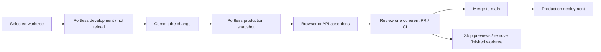

# Local previews and validation

Portless runs the selected Git worktree on a distinct local URL. Use development mode while
editing, then production mode to validate a clean committed snapshot. Creating or updating a PR
is separate from starting a preview. CI still runs the repository checks before merge.


```mermaid
flowchart LR
  Work[Selected worktree] --> Dev[Portless development / hot reload]
  Dev --> Commit[Commit the change]
  Commit --> Prod[Portless production snapshot]
  Prod --> Validate[Browser or API assertions]
  Validate --> Review[Review one coherent PR / CI]
  Review --> Merge[Merge to main]
  Merge --> Host[Production deployment]
  Review --> Cleanup[Stop previews / remove finished worktree]
```

## Install once, configure per project

The managed commands come from our fork in `~/dev/portless`, not the upstream npm package.
Node 24+ and the `portless` launcher must be on PATH. Check `portless preview --help`. The reusable
skill is installed in `.agents/skills/portless-preview/`; Claude and Cursor link to that same copy.
For another project, run `portless preview skill install --project /absolute/project`, or use
`--global` for your Codex installation. Update the managed copy through the installer. EveryField
requirements belong in this document, not a fork of the generic skill.

## Provision an owned local stack

With Node 24+, pnpm 10 and Docker running, remove the inherited `.env.local` link from the selected
worktree without reading or changing its target. Then run from that worktree:

```sh
node scripts/preview-local.mjs up /private/tmp/everyfield-my-task-runtime
```

The directory must not exist. This command creates labelled Docker pgvector, Neon HTTP and
migration websocket proxies, a loopback-only capture email service, private credentials, migrated
schema, role/data fixtures and a private Portless config. It ignores inherited database and mail
configuration and refuses worktrees containing `.env*` files other than `.env.example`. It applies
versioned migrations through `pnpm db:migrate`; it never repairs migration history.

Each task uses a different runtime directory. `ownership.json` records the resource names and
private configuration. `fixtures.json` contains fixture identifiers, local login credentials and
valid/expired token paths. Both files are private, not PR attachments. The fixtures include two
plants, planter/Admin/Member accounts, an assignment-only coach, network/sending-church readers,
people/tasks, completed/planning meetings, tags, skills, a household, logistics, sent-message
history and invitation/RSVP states. Fixture seeding never contacts a shared database.

```sh
portless preview up --project "$PWD" --mode development --config /private/tmp/everyfield-my-task-runtime/preview.json --json
# Commit changes and make the worktree clean before the final proof:
portless preview up --project "$PWD" --mode production --config /private/tmp/everyfield-my-task-runtime/preview.json --json
# Run a backend proof with only the stack's private environment:
node scripts/preview-local.mjs exec /private/tmp/everyfield-my-task-runtime pnpm exec tsx scripts/my-proof.ts
```

The runtime adapter is copied into the private directory under its SHA256 and checks that hash on
every start. Each process resolves the database driver from its own worktree or production snapshot.
Portless's installer and IPC worker receive no preload; only dev/build/start receive it. Record the
adapter hash and toolkit commit alongside the tested application commit. A sibling worktree may
invoke the committed toolkit by absolute path from its own working directory; each invocation still
provisions separate services and data.

Mail is captured by a local HTTP server with no delivery client or forwarding implementation.
Read its `/messages` endpoint from the reported loopback URL. No upload storage is provisioned;
upload flows remain unverified until separately owned scratch storage is configured. Scheduled
production services, provider credentials, telemetry credentials and feedback publishing are omitted.

If the local HTTPS CA is untrusted and installing it has not been authorized, use the documented
Portless disposable HTTP mode. Choose a distinct supervisor directory/port and keep those settings
for all operations against that supervisor:

```sh
export PORTLESS_PREVIEW_DIR=/private/tmp/everyfield-preview-http
export PORTLESS_PREVIEW_PORT=1356
export PORTLESS_PREVIEW_HTTP=1
```

Do not click through a browser certificate warning. URLs ending in `.localhost` stay local.

## Own the data and side effects

Portless tracks app processes; the local runner owns database and capture-mail resources.
The HTTP proxy preserves the application's Neon HTTP transport. The migration websocket proxy
permits only its own Postgres container. Driver overrides live in the explicitly loaded verification
adapter, never in application request modules.

Worktrees initially inherit `.env.local` from the main checkout: shell creation links it, while
Codex-managed creation copies it. Before development mode, replace that link or copied file in
the selected worktree with a private preview-specific file, or remove it and supply every required
value in the private config. Do not edit through a link back to the main checkout.
Inspect any other `.env*` files that Next may load. Explicit environment values take priority, but
omitted values can still come from files. Production snapshots omit ignored/untracked env files;
Portless forwards only its small host allowlist plus the configuration's explicit `env` values.

Apply migrations with `pnpm db:migrate` and seed against that disposable database using its private
environment. The local runner applies them to its new disposable database during `up`. Never reset,
re-key or seed a shared database to satisfy a preview. For email tests, verify that the server-side
transport captures messages and cannot deliver externally; a dummy API key or browser interception
is not isolation. Configure scratch storage when exercising uploads. Keep scheduled work disabled.

If provisioning resources automatically, use Portless `setup` plus an idempotent `teardown`.
Record owned resource IDs before creating them. If resources are provisioned manually, record
ownership and remove them separately after review. `down` cannot delete an external database or
capture service that the config never taught it to own.

## Iterate and prove

```sh
portless preview up --project /absolute/worktree --mode development --config /absolute/private.json --json
# After committing the final change and making the worktree clean:
portless preview up --project /absolute/worktree --mode production --config /absolute/private.json --json
portless preview status --json
portless preview logs PREVIEW_ID
```

Open the exact returned URL, normally `https://<name>.localhost:1355`. It is local to this computer.
Use `portless preview trust` for the local CA when needed. Do not use another checkout's server
or a direct backend port as branch evidence. The generic skill documents explicit HTTP test mode.

Record ID, URL, mode, SHA, acceptance assertions and evidence location. Production mode requires a
clean committed checkout and uses its own dependencies and build output. Changes after validation
need a fresh snapshot and affected assertions repeated. Use the browser-validation skill for UI,
and validate for API/data checks. Readiness is not a feature test. Documentation-only changes need
relevant document/config checks, not an app deployment.

A handoff includes the worktree, commit, preview identity, custom supervisor settings, private
config location, acceptance criteria, evidence and cleanup owner. Default leases last one hour;
use `portless preview renew PREVIEW_ID --ttl 7200` for a bounded review window. Keep pins exceptional
and explicitly remove them when finished. Describe expired/removed URLs honestly in the PR body.

## Finish and verify cleanup

Close the browser tabs/contexts created for the test. Save evidence outside the worktree. Stop
previews when nobody needs them; on the final preview, remove the source worktree when its changes
are committed and all agents/reviewers are finished:

```sh
portless preview down FIRST_PREVIEW_ID
portless preview down LAST_PREVIEW_ID --remove-worktree
portless preview status --json
portless preview gc
```

Ordinary `down` preserves the worktree and borrowed dependencies. Explicit worktree removal also
removes its ignored files, dependencies and build output, but retains its Git branch. The CLI
refuses the main checkout, dirty/detached/changed-HEAD worktrees and concurrent previews. Do not
force-delete past a refusal. A commit made after a development preview started changes its HEAD;
stop that preview and use a preview registered at the final commit for worktree removal.

Verify terminal status, the URL no longer serving the app, and removal from both disk and
`git worktree list`. `cleanup_pending` is not success: fix the cause and retry. `gc` only previews
cleanup until `--apply` is passed. Portless retains bounded per-preview logs/registry history and
does not prune the global pnpm store. Remove manually provisioned external resources separately.

## Deployment and PR policy

The Vercel project `everyfield-v2` has preview deployments disabled. Production remains connected
to `main`. `vercel.json` additionally disables automatic Git deployments on every other branch,
including branch names containing `/`. Existing branches need not adopt the file before the
project-level switch protects them. Manual deployments are outside the normal validation workflow.

Verify the project setting after changing hosting configuration. Both the project switch and the
repository rule would need deliberate reconsideration to restore hosted branch previews.
See Vercel's [Git configuration](https://vercel.com/docs/project-configuration/git-configuration).

One PR should deliver one reviewable outcome. Related issues can share it; fixes and review rounds
stay on it. Local iteration needs neither new PRs nor repeated pushes. Production still builds
when work lands on `main`, so grouping related work reduces those builds without combining
unrelated changes into a difficult review.

## Remove the local stack

First stop every Portless preview that uses the stack. Preserve evidence outside its private
runtime directory, then run cleanup twice to prove it is idempotent:

```sh
node scripts/preview-local.mjs down /private/tmp/everyfield-my-task-runtime
node scripts/preview-local.mjs down /private/tmp/everyfield-my-task-runtime
```

Cleanup checks directory identity and Docker ownership labels before removing resources. It never
adopts a pre-existing directory. Failed setup leaves its ownership record for this same cleanup
command; do not reuse a partially provisioned stack. Keep the private directory until every caller
has finished. Portless `down` alone does not remove this manually provisioned database/mail stack.
