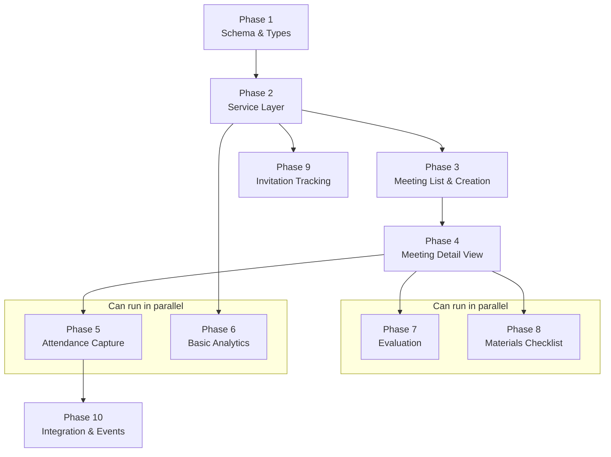

# F3: Vision Meeting Management – Implementation Plan

**Version:** 1.0
**Date:** February 7, 2026
**FRD Version:** 1.3

---

## References

- [Feature Requirements Document](./frd.md) — What to build
- [Implementation Checklist](./checklist.md) — Track progress
- [People/CRM Patterns](../people-crm/) — Reference implementation for similar patterns

---

## Architecture Overview

Vision Meeting Management follows the same architecture established by People/CRM (F2):

```
src/
├── db/schema/vision-meetings.ts         # Drizzle schema (all tables)
├── lib/
│   ├── vision-meetings/
│   │   ├── service.ts                   # Core CRUD (meetings, attendance)
│   │   ├── locations.ts                 # Location CRUD
│   │   ├── events.ts                    # Event type definitions & emitters
│   │   ├── types.ts                     # TypeScript types & options
│   │   └── analytics.ts                 # Metrics & trend queries
│   └── validations/
│       └── vision-meetings.ts           # Zod schemas
├── app/(dashboard)/vision-meetings/
│   ├── page.tsx                         # Meeting list (server component)
│   ├── actions.ts                       # Server actions
│   ├── new/page.tsx                     # Schedule meeting
│   └── [id]/
│       ├── layout.tsx                   # Detail layout with tabs
│       ├── page.tsx                     # Details tab
│       ├── attendance/page.tsx          # Attendance capture
│       └── analytics/page.tsx           # Meeting analytics
└── components/vision-meetings/
    ├── meeting-list.tsx                  # List view
    ├── meeting-card.tsx                  # Card for list view
    ├── meeting-form.tsx                  # Create/edit form
    ├── meeting-header.tsx               # Detail page header
    ├── meeting-tabs.tsx                 # Tab navigation
    ├── attendance-capture.tsx           # Attendance capture screen
    ├── attendee-quick-add.tsx           # Quick add form
    ├── location-picker.tsx             # Location select/create
    └── analytics-charts.tsx            # Charts for analytics
```

---

## Key Technical Decisions

| Decision | Choice | Rationale |
|----------|--------|-----------|
| Enum storage | `varchar` with `.$type<>()` | Matches People/CRM pattern (no `pgEnum`) |
| Meeting numbering | Application-layer auto-increment | `MAX(meeting_number) + 1` per `church_id` in service layer |
| Attendance finalization | Atomic transaction | Insert all attendance + emit events in single transaction |
| Event emission | Stub pattern (console log) | Matches F2 events.ts; replaced when event bus is built |
| Forms | Server actions with `FormData` | Matches People/CRM `ActionResult<T>` pattern |
| Tabs | Link-based navigation | Matches People/CRM person detail tabs |
| Charts | Client components | Recharts or similar; rendered client-side |

---

## Phase Dependency Graph



---

## Phases

### Phase 1: Foundation (Schema & Types) — Sequential

**Goal:** Define all database tables, enums, validation schemas, and TypeScript types.

**Files to create:**

1. `src/db/schema/vision-meetings.ts` — All 6 tables:
   - `locations` — Saved venues
   - `visionMeetings` — Core meeting entity
   - `visionMeetingAttendance` — Per-attendee records
   - `invitations` — Invitation tracking (Should Have, but schema created now)
   - `meetingEvaluations` — Quality factor scores (Should Have, but schema created now)
   - `meetingChecklistItems` — Materials checklist (Should Have, but schema created now)

2. `src/db/schema/index.ts` — Add exports for new tables

3. `src/lib/validations/vision-meetings.ts` — Zod schemas:
   - `meetingCreateSchema` / `meetingUpdateSchema`
   - `locationCreateSchema` / `locationUpdateSchema`
   - `attendanceCreateSchema`
   - `evaluationCreateSchema` (for Phase 7)

4. `src/lib/vision-meetings/types.ts` — TypeScript types:
   - Drizzle inferred types (`VisionMeeting`, `NewVisionMeeting`, etc.)
   - Options types (`ListMeetingsOptions`, `GetMeetingOptions`)
   - `ActionResult<T>` reuse from existing pattern

5. Generate and run migration

**Enum definitions (as `const` arrays):**

```typescript
export const meetingStatuses = [
  "planning", "ready", "in_progress", "completed", "cancelled"
] as const;

export const attendanceTypes = [
  "first_time", "returning", "core_group"
] as const;

export const responseStatuses = [
  "interested", "ready_commit", "questions", "not_interested"
] as const;

export const invitationStatuses = [
  "invited", "confirmed", "maybe", "declined", "attended", "no_show"
] as const;

export const checklistCategories = [
  "essential", "materials", "setup", "av", "organization"
] as const;
```

**Schema patterns to follow:**
- `uuid("id").primaryKey().defaultRandom()` for all PKs
- `uuid("church_id").references(() => churches.id).notNull()` on every table
- `timestamp("created_at").defaultNow().notNull()` and `timestamp("updated_at").defaultNow().notNull()`
- Indexes on `church_id` and frequently queried columns (`meeting_id`, `person_id`)
- Unique constraint on `(meeting_id, person_id)` for attendance

**Estimated effort:** 1 session

---

### Phase 2: Core Service Layer — Sequential (after Phase 1)

**Goal:** CRUD operations for meetings, locations, and attendance.

**Files to create:**

1. `src/lib/vision-meetings/service.ts` — Meeting CRUD:
   - `createMeeting(churchId, userId, data)` — Auto-assigns `meeting_number`
   - `getMeeting(churchId, meetingId)` — With attendance counts
   - `updateMeeting(churchId, meetingId, data)` — Status transitions
   - `deleteMeeting(churchId, meetingId)` — Soft delete or hard delete
   - `listMeetings(churchId, options)` — Filter by status, pagination
   - `updateMeetingStatus(churchId, meetingId, newStatus)`

2. `src/lib/vision-meetings/locations.ts` — Location CRUD:
   - `createLocation(churchId, data)`
   - `listLocations(churchId)` — Active locations only
   - `updateLocation(churchId, locationId, data)`
   - `deactivateLocation(churchId, locationId)` — Soft disable

3. `src/lib/vision-meetings/events.ts` — Event definitions:
   - `MeetingAttendanceRecordedEvent` interface
   - `MeetingAttendanceFinalizedEvent` interface
   - `MeetingCompletedEvent` interface
   - `emitAttendanceRecorded()` — Stub
   - `emitAttendanceFinalized()` — Stub
   - `emitMeetingCompleted()` — Stub

4. `src/app/(dashboard)/vision-meetings/actions.ts` — Server actions:
   - `createMeetingAction(formData)`
   - `updateMeetingAction(formData)`
   - `deleteMeetingAction(meetingId)`
   - `createLocationAction(formData)`
   - `updateLocationAction(formData)`

**Meeting number auto-increment pattern:**

```typescript
async function getNextMeetingNumber(churchId: string): Promise<number> {
  const result = await db
    .select({ maxNum: sql<number>`COALESCE(MAX(meeting_number), 0)` })
    .from(visionMeetings)
    .where(eq(visionMeetings.churchId, churchId));
  return (result[0]?.maxNum ?? 0) + 1;
}
```

**All service functions follow the established pattern:**
- `churchId` as first parameter
- `and(eq(table.churchId, churchId), ...)` for all queries
- Return created/updated entity from mutations
- `.returning()` on inserts/updates

**Estimated effort:** 1-2 sessions

---

### Phase 3: Meeting List & Creation UI — Sequential (after Phase 2)

**Goal:** Users can see all meetings and schedule new ones.

**Files to create:**

1. `src/app/(dashboard)/vision-meetings/page.tsx` — Server component:
   - Fetch meetings with `listMeetings(churchId, { status })`
   - Split into upcoming/past sections
   - Render `MeetingList` component

2. `src/components/vision-meetings/meeting-list.tsx` — Client component:
   - Upcoming/Past toggle tabs
   - Grid of `MeetingCard` components
   - Empty state for no meetings

3. `src/components/vision-meetings/meeting-card.tsx` — Card component:
   - Date, time, meeting number
   - Location name
   - Status badge
   - Attendance summary (for past meetings)
   - View/Edit actions

4. `src/app/(dashboard)/vision-meetings/new/page.tsx` — Schedule meeting page

5. `src/components/vision-meetings/meeting-form.tsx` — Create/edit form:
   - Date/time picker
   - Location picker (select saved or add new inline)
   - Estimated attendance
   - Notes textarea
   - Submit via server action

6. `src/components/vision-meetings/location-picker.tsx` — Location selection:
   - Dropdown of saved locations
   - "Add new location" option
   - Inline location creation form

7. Enable nav item — Remove `isDisabled: true` from `src/lib/navigation.ts`

**Estimated effort:** 1-2 sessions

---

### Phase 4: Meeting Detail View — Sequential (after Phase 3)

**Goal:** Full meeting detail page with tabs and status management.

**Files to create:**

1. `src/app/(dashboard)/vision-meetings/[id]/layout.tsx` — Detail layout:
   - Fetch meeting data
   - Render `MeetingHeader` + `MeetingTabs`
   - `{children}` for tab content

2. `src/app/(dashboard)/vision-meetings/[id]/page.tsx` — Details tab:
   - Meeting info display/edit
   - Location details
   - Status management (planning -> ready -> in_progress -> completed)

3. `src/components/vision-meetings/meeting-header.tsx`:
   - Meeting number and date
   - Location with address
   - Days until meeting countdown (or "X days ago")
   - Status badge with transition buttons

4. `src/components/vision-meetings/meeting-tabs.tsx`:
   - Link-based tabs matching People/CRM pattern
   - Tabs change based on meeting status (planning vs completed)
   - Planning mode: Details, (Invitations), (Logistics), (Agenda)
   - Completed mode: Attendance, (Follow-Up), (Outcomes), (Evaluation)

5. `src/components/vision-meetings/meeting-edit-dialog.tsx`:
   - Dialog wrapper around `MeetingForm` for inline editing

**Estimated effort:** 1 session

---

### Phase 5: Attendance Capture — Sequential (after Phase 4), Parallel with Phase 6

**Goal:** Record meeting attendance with person linking and event emission.

**Files to create/update:**

1. `src/lib/vision-meetings/service.ts` — Add attendance functions:
   - `addAttendee(churchId, meetingId, data)` — Single attendee
   - `removeAttendee(churchId, meetingId, personId)`
   - `listAttendees(churchId, meetingId)` — With person details
   - `finalizeAttendance(churchId, meetingId, userId)` — Atomic:
     - Set `actual_attendance` count
     - Emit `meeting.attendance.recorded` per attendee
     - Emit `meeting.attendance.finalized` with new attendee IDs
   - `getAttendanceSummary(churchId, meetingId)` — Counts by type

2. `src/app/(dashboard)/vision-meetings/actions.ts` — Add actions:
   - `addAttendeeAction(formData)` — Add single attendee
   - `quickAddAttendeeAction(formData)` — Create Person + add as attendee
   - `removeAttendeeAction(meetingId, personId)`
   - `finalizeAttendanceAction(meetingId)`

3. `src/app/(dashboard)/vision-meetings/[id]/attendance/page.tsx`:
   - Server component fetching meeting + attendees + available people

4. `src/components/vision-meetings/attendance-capture.tsx` — Main screen:
   - Person search (reuse People/CRM search)
   - Attendee list with type badges
   - Running counts (total, new, returning)
   - Finalize button

5. `src/components/vision-meetings/attendee-quick-add.tsx`:
   - Inline form: first name, last name, email, phone
   - Invited-by person picker
   - Creates Person record + attendance entry in one action

6. `src/components/vision-meetings/attendee-row.tsx`:
   - Name, attendance type badge, invited-by attribution
   - Remove button

**Integration with F2:**
- Reuse `createPerson()` from `src/lib/people/service.ts` for quick-add
- Reuse person search for "Search existing contacts"
- Event emission triggers F2's `handleVisionMeetingAttendance` (deferred stub)

**Estimated effort:** 2 sessions

---

### Phase 6: Basic Analytics — Parallel with Phase 5 (after Phase 2)

**Goal:** Attendance count trends and new-vs-returning split.

**Files to create:**

1. `src/lib/vision-meetings/analytics.ts` — Query functions:
   - `getAttendanceTrend(churchId, limit?)` — Meetings with counts over time
   - `getNewVsReturning(churchId, limit?)` — Stacked breakdown per meeting
   - `getMeetingSummaryStats(churchId)` — Total meetings, avg attendance, etc.

2. `src/app/(dashboard)/vision-meetings/[id]/analytics/page.tsx` — Or:
   `src/app/(dashboard)/vision-meetings/analytics/page.tsx` — Aggregate view

3. `src/components/vision-meetings/analytics-charts.tsx` — Client component:
   - Attendance trend line chart
   - New vs returning stacked bar chart
   - Summary stat cards (total meetings, avg attendance, growth %)

**Chart library:** Install `recharts` (already commonly used with shadcn):

```bash
pnpm add recharts
```

**Estimated effort:** 1 session

---

### Phase 7: Meeting Evaluation (Should Have) — Parallel with Phase 8 (after Phase 4)

**Goal:** Self-assess 8 quality factors after completed meetings.

**Files to create:**

1. `src/lib/vision-meetings/service.ts` — Add evaluation functions:
   - `createEvaluation(churchId, meetingId, userId, data)`
   - `getEvaluation(churchId, meetingId)`
   - `getEvaluationTrend(churchId, limit?)` — Score trends over time

2. `src/app/(dashboard)/vision-meetings/actions.ts` — Add:
   - `createEvaluationAction(formData)`

3. Evaluation tab on meeting detail (add to completed meeting tabs)

4. `src/components/vision-meetings/evaluation-form.tsx`:
   - 8 score sliders or radio groups (1-5 scale)
   - Quality factor labels and descriptions
   - Improvement notes textarea
   - Auto-calculated total score

5. `src/components/vision-meetings/evaluation-summary.tsx`:
   - Radar chart of 8 factors
   - Comparison to previous meeting scores
   - Total score display

**Estimated effort:** 1 session

---

### Phase 8: Materials Checklist (Should Have) — Parallel with Phase 7 (after Phase 3)

**Goal:** Auto-populated checklist of Vision Meeting kit items per meeting.

**Files to create:**

1. `src/lib/vision-meetings/service.ts` — Add checklist functions:
   - `populateChecklist(churchId, meetingId)` — Create items from kit template
   - `updateChecklistItem(churchId, itemId, data)` — Toggle, assign, note
   - `getChecklist(churchId, meetingId)` — All items with status
   - `getChecklistSummary(churchId, meetingId)` — Checked count / total

2. `src/lib/vision-meetings/kit-template.ts` — Default kit items:
   - 18 items from FRD's Vision Meeting Kit Checklist table
   - Each with `item_name` and `category`

3. `src/app/(dashboard)/vision-meetings/actions.ts` — Add:
   - `toggleChecklistItemAction(itemId)`
   - `updateChecklistItemAction(formData)`

4. Logistics tab on meeting detail (planning mode)

5. `src/components/vision-meetings/materials-checklist.tsx`:
   - Grouped by category
   - Checkbox, item name, notes field, assign to person
   - Progress indicator (X/18 ready)

**Auto-population trigger:** When a meeting is created (in `createMeeting`), call `populateChecklist` to seed items from the template.

**Estimated effort:** 1 session

---

### Phase 9: Invitation Tracking (Should Have) — After Phase 2, Parallel with Phase 3+

**Goal:** Track per-member invitation activity and display leaderboard.

**Files to create:**

1. `src/lib/vision-meetings/invitations.ts` — Invitation CRUD:
   - `createInvitation(churchId, meetingId, data)`
   - `listInvitations(churchId, meetingId)`
   - `updateInvitationStatus(churchId, invitationId, status)`
   - `getInvitationLeaderboard(churchId, meetingId)` — Per-member counts
   - `getInvitationSummary(churchId, meetingId)` — Totals

2. `src/app/(dashboard)/vision-meetings/actions.ts` — Add:
   - `createInvitationAction(formData)`
   - `updateInvitationStatusAction(formData)`

3. Invitations tab on meeting detail (planning mode)

4. `src/components/vision-meetings/invitation-tracker.tsx`:
   - Core Group member list with invitation counts
   - Add invitation form
   - Status update dropdowns
   - Summary stats

5. `src/components/vision-meetings/invitation-leaderboard.tsx`:
   - Ranked list of members by invitation count
   - Target indicator (5 per member)
   - Visual indicators for above/below target

**Estimated effort:** 1 session

---

### Phase 10: Integration & Events — Sequential (after Phase 5)

**Goal:** Wire up cross-feature event emission and connect deferred handlers.

**Tasks:**

1. **Wire F2 integration in attendance finalization:**
   - When `finalizeAttendance` is called, emit `meeting.attendance.recorded` events
   - Update F2's `handleVisionMeetingAttendance` to actually process events (remove `throw` from deferred stub in `src/lib/people/events.ts`)
   - Person status progression: Prospect -> Attendee

2. **Wire F5 integration (deferred until F5 exists):**
   - `meeting.attendance.finalized` event is emitted but no subscriber yet
   - Add TODO stub in a future `src/lib/tasks/events.ts`

3. **Dashboard metrics (deferred until F4 exists):**
   - `meeting.completed` event is emitted but no subscriber yet
   - Metrics query functions in `analytics.ts` are available for F4 to consume

4. **Update church privacy settings:**
   - `share_vision_meetings` toggle already exists in `church_privacy_settings` schema
   - Ensure Vision Meeting data respects this toggle for oversight users

**Estimated effort:** 1 session

---

## Parallel Execution Summary

```
Week 1:
  [Phase 1] Schema & Types ──────────────►
                                           [Phase 2] Service Layer ──────────►

Week 2:
  [Phase 3] Meeting List & Creation ──────────────────────────────────────────►

Week 3:
  [Phase 4] Meeting Detail View ──────────────────►
                                                    ┌── [Phase 5] Attendance ──►
                                                    └── [Phase 6] Analytics ───►

Week 4:
  ┌── [Phase 7] Evaluation ────────►
  ├── [Phase 8] Checklist ─────────►    (all three parallel)
  └── [Phase 9] Invitations ───────►

Week 5:
  [Phase 10] Integration & Events ────►
```

**Critical path:** Phase 1 -> 2 -> 3 -> 4 -> 5 -> 10

**Parallel lanes after Phase 4:**
- Lane A: Phase 5 (Attendance) + Phase 10 (Integration)
- Lane B: Phase 6 (Analytics)
- Lane C: Phase 7 (Evaluation) + Phase 8 (Checklist) + Phase 9 (Invitations)

---

## Dependencies on Other Features

| Dependency | Type | Status | Impact if Missing |
|------------|------|--------|-------------------|
| F2 People/CRM (Person lookup) | Hard | Implemented | Cannot link attendees to Person records |
| F2 People/CRM (Event handlers) | Soft | Stub exists | Status progression won't auto-fire; manual fallback |
| F5 Task Management (Follow-up tasks) | Soft | Not built | Follow-up tasks emitted but not created; manual fallback |
| F6 Document Templates (Kit templates) | Soft | Not built | Checklist uses hardcoded template; swap to F6 later |
| F4 Dashboard (Metrics) | Soft | Not built | Events emitted but not consumed; dashboard not affected |

---

## Risk Mitigation

| Risk | Mitigation |
|------|------------|
| Meeting number race condition | Use `SELECT MAX() + 1` inside the insert transaction; add unique constraint on `(church_id, meeting_number)` |
| Attendance finalization partial failure | Wrap all operations (attendance inserts, event emissions, count update) in a single database transaction |
| Large attendance lists | Cursor pagination on attendee list; lazy load in capture screen |
| Chart library bundle size | Dynamic import for recharts components; only loaded on analytics pages |
| F5 not yet available for follow-up tasks | Event emission is fire-and-forget with stub; tasks created manually until F5 exists |

---

## Testing Strategy

**After each phase, verify:**

1. TypeScript compiles without errors (`pnpm tsc --noEmit`)
2. Linter passes (`pnpm lint`)
3. Database migrations run successfully (`pnpm db:push` or `pnpm db:migrate`)
4. UI renders correctly at each route
5. Server actions work with proper auth and tenant scoping
6. All queries scope by `church_id`

**Key integration tests (manual or automated):**

- Create meeting -> appears in list -> view detail -> capture attendance -> finalize -> events logged
- Location created -> reused across meetings -> deactivated -> no longer selectable
- Attendance finalization -> Person records created for new attendees -> invited-by tracked
- Meeting number auto-increments correctly per church (no duplicates)
