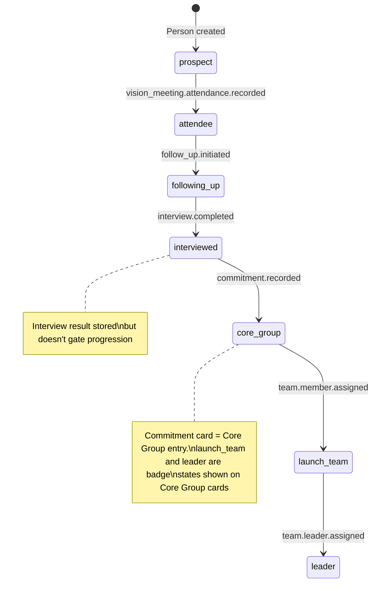

# F2: People / CRM Management
## Feature Requirements Document (FRD)

**Version:** 1.2  
**Date:** February 3, 2026  
**Feature Code:** F2

---

## References

- [Product Brief](../../product-brief.md) - Core concepts and domain language
- [System Architecture](../../system-architecture.md) - Data ownership and cross-cutting services
- [Core Data Contracts](../../core-data-contracts.md) - Shared entity contracts (Church, User, Person, Phase)

---

## Overview

People / CRM Management tracks all individuals from initial contact through committed team member and beyond. This feature serves as the central repository for relationship data, enabling planters to manage prospects, qualify potential members, and track the journey of each person toward full engagement.

---

## Functional Requirements

### Must Have (MVP)

| ID | Requirement | Description |
|----|-------------|-------------|
| P-001 | Person record management | Create, read, update, delete person records |
| P-002 | Contact information | Store name, email, phone, address for each person |
| P-003 | Status tracking | Track person's status in the pipeline (prospect through leader) |
| P-004 | Source tracking | Record how each person was reached (referral, social media, etc.) |
| P-005 | Search and filter | Search by name, email, phone; filter by status, tags, source |
| P-006 | List view | Display all contacts in a searchable, filterable list |
| P-007 | Pipeline view | Visual kanban-style view of contacts by status |
| P-008 | Person detail view | Full profile page with all contact information |
| P-009 | Activity timeline | Chronological log of all interactions per person |
| P-010 | Note adding | Add timestamped notes to person records |
| P-011 | Tagging | Apply and filter by custom tags |
| P-012 | Status progression | Move people through pipeline stages with validation |

### Should Have

| ID | Requirement | Description |
|----|-------------|-------------|
| P-013 | 4 C's assessment | Assessment form to rate Committed, Compelled, Contagious, Courageous |
| P-014 | Interview tracking | Capture 5 criteria interview results (Maturity, Gifted, Chemistry, Right Reasons, Season) |
| P-015 | Commitment tracking | Record signed commitments with dates |
| P-016 | Skills inventory | Track skills and gifts for team matching |
| P-017 | Bulk import | Import contacts from CSV/spreadsheet |
| P-018 | Duplicate detection | Identify and merge duplicate records |
| P-019 | Quick add | Simplified form for rapid contact entry |
| P-020 | Conversion metrics | Display conversion rates between pipeline stages |
| P-021 | Team assignment visibility | Show ministry team assignments on person profile |
| P-022 | Training status display | Show training completion on person profile |

### Should Have (continued)

| ID | Requirement | Description |
|----|-------------|-------------|
| P-023 | Household grouping | Link family members together |
| P-024 | Photo support | Profile photos for contacts (avatars in lists, larger on profile) |
| P-025 | Potential duplicates view | Dedicated section showing potential duplicate records for user review |

### Nice to Have (Future)

| ID | Requirement | Description |
|----|-------------|-------------|
| P-026 | External ChMS sync | Bidirectional sync with Planning Center, Breeze, etc. |
| P-027 | Bulk export | Export contacts to CSV |
| P-028 | Custom fields | Church-defined additional fields |
| P-029 | Communication preferences | Track preferred contact method |
| P-030 | Birthday/anniversary tracking | Date tracking for personal outreach |

---

## Screens

### 1. People List View

The primary landing page for managing contacts.

**Layout:**

```
┌──────────────────────────────────────────────────────────────────────────────┐
│  People                                              [+ Add Person]          │
├──────────────────────────────────────────────────────────────────────────────┤
│                                                                              │
│  🔍 Search...        [Status ▼] [Tags ▼] [Source ▼] [Team ▼] [More ▼]       │
│                                                                              │
│  ─────────────────────────────────────────────────────────────────────────   │
│                                                                              │
│  View: [List] [Pipeline] [Table]                                   245 total │
│                                                                              │
│  ┌────────────────────────────────────────────────────────────────────────┐  │
│  │ ○ John Smith                                    Core Group Member      │  │
│  │   john@email.com • 555-0123                     Worship Team          │  │
│  │   Source: Personal Referral                     ●●●● 4 C's: Strong    │  │
│  │   Added: Jan 15, 2026                           [View]                │  │
│  └────────────────────────────────────────────────────────────────────────┘  │
│                                                                              │
│  ┌────────────────────────────────────────────────────────────────────────┐  │
│  │ ○ Sarah Johnson                                 Following Up           │  │
│  │   sarah@email.com • 555-0456                    No team assigned       │  │
│  │   Source: Vision Meeting                        ○○○○ 4 C's: Pending   │  │
│  │   Added: Jan 20, 2026                           [View]                │  │
│  └────────────────────────────────────────────────────────────────────────┘  │
│                                                                              │
└──────────────────────────────────────────────────────────────────────────────┘
```

**Features:**
- Quick search by name, email, phone
- Multi-filter capability (status, tags, source, team assignment)
- Toggle between List, Pipeline, and Table views
- Bulk actions (tag, export, message)
- Quick status indicator showing position in journey

---

### 2. Pipeline View

Visual kanban showing members at each stage. The pipeline displays the five primary pipeline stages as columns. "Launch Team" and "Leader" statuses are milestone badges on Core Group members rather than separate columns.

**Layout:**

```
┌──────────────────────────────────────────────────────────────────────────────┐
│  People Pipeline                                           [Configure ⚙]     │
├──────────────────────────────────────────────────────────────────────────────┤
│                                                                              │
│  Prospect    Attendee    Following Up   Interviewed   Core Group             │
│  ────────    ────────    ────────────   ───────────   ──────────             │
│     12          8            15              5            65                 │
│                                                                              │
│  ┌──────┐   ┌──────┐      ┌──────┐      ┌──────┐     ┌──────┐              │
│  │ John │   │Sarah │      │ Mike │      │ Lisa │     │ Amy  │              │
│  │Smith │   │Brown │      │Jones │      │Davis │     │ 🚀   │              │
│  └──────┘   └──────┘      └──────┘      └──────┘     └──────┘              │
│  ┌──────┐   ┌──────┐      ┌──────┐      ┌──────┐     ┌──────┐              │
│  │ Jane │   │ ...  │      │ ...  │      │ ...  │     │ Dan  │              │
│  │ Doe  │   │      │      │      │      │      │     │ ⭐🚀 │              │
│  └──────┘   └──────┘      └──────┘      └──────┘     └──────┘              │
│                                                                              │
│  ─────────────────────────────────────────────────────────────────────────   │
│  Conversion Rates:  Prospect→Attendee: 67%  |  Interviewed→Core Group: 45%  │
│                                                                              │
│  Legend: 🚀 = Launch Team   ⭐ = Leader                                      │
└──────────────────────────────────────────────────────────────────────────────┘
```

**Kanban Columns (6):**

| Column | Description |
|--------|-------------|
| Prospect | Initial contacts, not yet attended a meeting |
| Attendee | Has attended at least one Vision Meeting |
| Following Up | Active follow-up in progress |
| Interviewed | Interview completed (any result) |
| Committed | Signed commitment card |
| Core Group | Active Core Group member |

**Status Badges (shown on Core Group cards):**
- 🚀 **Launch Team** - Assigned to ministry team (Phase 2+)
- ⭐ **Leader** - Has leadership role on ministry team

**Features:**
- Drag-and-drop between stages (triggers status change events)
- Count per stage with visual sizing
- Conversion rate display between stages
- Click card to view person detail
- Filter pipeline by source, date range, or team assignment

---

### 3. Person Detail View

Complete profile for an individual.

**Header Section:**
- Name, photo/avatar
- Contact info (email, phone, address)
- Current status badge
- Quick actions: Edit, Message, Schedule, Assign

**Tabs:**

#### Tab: Overview
- Status progression timeline
- 4 C's assessment visual (if Core Group)
- Current team assignments
- Tags
- Source information
- Key dates (added, first attended, committed, etc.)

#### Tab: Activity Timeline
- Chronological list of all interactions:
  - Vision Meeting attendance
  - Follow-up calls/messages
  - Interview conducted
  - Commitment signed
  - Training completed
  - Team assigned
- Add note capability

#### Tab: Assessments
- 4 C's Assessment form and history
- Interview notes (5 criteria)
- Skills/gifts inventory
- Qualification status

#### Tab: Teams & Training
- Current team assignments with roles
- Training completion status
- Small group membership (if applicable)

---

### 4. Person Add/Edit Form

**Fields:**

| Field | Type | Required | Description |
|-------|------|----------|-------------|
| First Name | Text | Yes | First name |
| Last Name | Text | Yes | Last name |
| Email | Email | No | Email address |
| Phone | Phone | No | Phone number |
| Address | Address | No | Full address |
| Source | Dropdown | No | How they were reached |
| Source Details | Text | No | Referrer name or specifics |
| Status | Dropdown | Yes | Current stage in journey |
| Tags | Multi-select | No | Classification tags |
| Notes | Rich text | No | General notes |

**Source Options:**
- Personal Referral
- Social Media
- Vision Meeting
- Website
- Event
- Partner Church
- Other

---

### 5. Quick Add Form

Simplified form for rapid contact entry when users need to add multiple people quickly.

**Layout:**

```
┌──────────────────────────────────────────────────────────────────────────────┐
│  Quick Add Person                                               [Full Form →]│
├──────────────────────────────────────────────────────────────────────────────┤
│                                                                              │
│  First Name *        Last Name *                                             │
│  [____________]      [____________]                                          │
│                                                                              │
│  Email               Phone                                                   │
│  [____________]      [____________]                                          │
│                                                                              │
│  Source: [Personal Referral ▼]                                               │
│                                                                              │
│                                    [Cancel]  [Save & Add Another]  [Save]   │
│                                                                              │
└──────────────────────────────────────────────────────────────────────────────┘
```

**Fields:**

| Field | Type | Required | Default |
|-------|------|----------|---------|
| First Name | Text | Yes | — |
| Last Name | Text | Yes | — |
| Email | Email | No | — |
| Phone | Phone | No | — |
| Source | Dropdown | No | "Other" |

**Behavior:**
- Status defaults to "Prospect"
- "Save & Add Another" clears the form and keeps it open for the next entry
- "Full Form →" link opens the complete Person Add/Edit Form
- No validation beyond required fields

---

### 6. 4 C's Assessment Screen

Assessment form for Core Group member qualities.

**Layout:**

```
┌──────────────────────────────────────────────────────────────────────────────┐
│  4 C's Assessment: John Smith                                                │
│  Core Group Member since Jan 15, 2026                                        │
├──────────────────────────────────────────────────────────────────────────────┤
│                                                                              │
│  COMMITTED                                                          4/5     │
│  Signed commitment, consistent attendance, faithful giving                   │
│  ──────────────────────────────────────────────────────────────────────────  │
│  ○ 1 - Rarely demonstrates    ● 4 - Consistently demonstrates               │
│  ○ 2 - Sometimes demonstrates ○ 5 - Exemplary                               │
│  ○ 3 - Often demonstrates                                                   │
│  Notes: [Attends every meeting, signed card Jan 15]                         │
│                                                                              │
│  ──────────────────────────────────────────────────────────────────────────  │
│                                                                              │
│  COMPELLED                                                          5/5     │
│  Internally motivated by the vision, can articulate the why                 │
│  ──────────────────────────────────────────────────────────────────────────  │
│  ○ 1   ○ 2   ○ 3   ○ 4   ● 5                                                │
│  Notes: [Passionate advocate, shares vision clearly]                        │
│                                                                              │
│  ──────────────────────────────────────────────────────────────────────────  │
│                                                                              │
│  CONTAGIOUS                                                         3/5     │
│  Actively inviting others, growing their sphere of influence               │
│  ──────────────────────────────────────────────────────────────────────────  │
│  ○ 1   ○ 2   ● 3   ○ 4   ○ 5                                                │
│  Notes: [Has invited 2 people, could be more active]                        │
│                                                                              │
│  ──────────────────────────────────────────────────────────────────────────  │
│                                                                              │
│  COURAGEOUS                                                         4/5     │
│  Bold in action despite uncertainty, willing to sacrifice                   │
│  ──────────────────────────────────────────────────────────────────────────  │
│  ○ 1   ○ 2   ○ 3   ● 4   ○ 5                                                │
│  Notes: [Stepped up to lead setup team]                                     │
│                                                                              │
│  ──────────────────────────────────────────────────────────────────────────  │
│                                                                              │
│  Overall Score: 16/20 (Strong)                       [Cancel] [Save]        │
│                                                                              │
└──────────────────────────────────────────────────────────────────────────────┘
```

---

### 7. Interview Screen

Capture interview using the 5 criteria.

**Layout:**

```
┌──────────────────────────────────────────────────────────────────────────────┐
│  Member Interview: Sarah Johnson                                             │
│  Date: January 22, 2026                                                      │
├──────────────────────────────────────────────────────────────────────────────┤
│                                                                              │
│  1. MATURITY                                                    [✓ Pass]    │
│     Are they spiritually and emotionally mature?                            │
│     ─────────────────────────────────────────────────────────────────────   │
│     Notes: [Shows evidence of spiritual growth, handles conflict well]      │
│                                                                              │
│  2. GIFTED                                                      [✓ Pass]    │
│     Do they bring a needed skill set?                                       │
│     ─────────────────────────────────────────────────────────────────────   │
│     Notes: [Professional musician, could lead worship team]                 │
│                                                                              │
│  3. CHEMISTRY                                                   [✓ Pass]    │
│     Is there good chemistry with leadership?                                │
│     ─────────────────────────────────────────────────────────────────────   │
│     Notes: [Great conversations, aligns with vision]                        │
│                                                                              │
│  4. RIGHT REASONS                                               [✓ Pass]    │
│     Are they coming for the right reasons?                                  │
│     ─────────────────────────────────────────────────────────────────────   │
│     Notes: [Genuinely called to plant, not running from problems]           │
│                                                                              │
│  5. SEASON OF LIFE                                              [⚠ Concern] │
│     Are they in a stable season of life?                                    │
│     ─────────────────────────────────────────────────────────────────────   │
│     Notes: [New baby, may have limited availability initially]              │
│                                                                              │
│  ──────────────────────────────────────────────────────────────────────────  │
│                                                                              │
│  Overall Assessment: [Qualified with notes ▼]                               │
│  Next Steps: [Proceed to commitment conversation]                           │
│                                                          [Cancel] [Save]    │
│                                                                              │
└──────────────────────────────────────────────────────────────────────────────┘
```

---

### 8. Commitment Recording Screen

Record when a person signs a commitment card.

**Layout:**

```
┌──────────────────────────────────────────────────────────────────────────────┐
│  Record Commitment: Sarah Johnson                                            │
├──────────────────────────────────────────────────────────────────────────────┤
│                                                                              │
│  Commitment Type *                                                           │
│  ○ Core Group Commitment                                                     │
│  ○ Launch Team Commitment                                                    │
│                                                                              │
│  Date Signed *                                                               │
│  [January 22, 2026      📅]                                                  │
│                                                                              │
│  Witnessed By                                                                │
│  [Pastor John Smith ▼]                                                       │
│                                                                              │
│  Upload Signed Document (optional)                                           │
│  [Choose file...] or drag and drop                                          │
│                                                                              │
│  Notes                                                                       │
│  [___________________________________________________________]              │
│  [___________________________________________________________]              │
│                                                                              │
│                                                          [Cancel] [Save]    │
│                                                                              │
└──────────────────────────────────────────────────────────────────────────────┘
```

**Behavior:**
- Recording a commitment automatically advances person status to "Committed"
- Witness field populated with church team members (optional)
- Document upload stores scanned commitment card

---

## Workflows

### Workflow 1: Adding a New Contact

**Trigger:** User clicks "+ Add Person"

**Steps:**

```
[+ Add Person button clicked]
    ↓
[Add Person form opens]
    ↓
Enter basic info (name, contact, source)
    ↓
Set initial status (typically "Prospect")
    ↓
Add optional tags
    ↓
[Save]
    ↓
Person created in database
    ↓
Redirect to Person Detail View
    ↓
[Optional]: Create follow-up task
```

---

### Workflow 2: Automatic Status Progression

**Trigger:** Action recorded in this or another feature (Vision Meeting attendance, interview completed, commitment signed, team assigned, etc.)

**Steps:**

```
[Triggering action occurs]
├── F3: Person marked as attended Vision Meeting
├── F2: Interview form saved
├── F2: Commitment recorded
├── F8: Person assigned to ministry team
└── etc.
    ↓
[Event emitted by source feature]
    ↓
[F2 receives event and evaluates status]
    ↓
If action implies status advancement:
    ↓
    Auto-advance status (may skip intermediate statuses)
    ↓
    Emit `person.status.changed` event
    ↓
    Activity logged in timeline
    ↓
    Metrics updated (dashboard, pipeline counts)

[Manual Override Path]
    ↓
[Pipeline drag-drop] OR [Person Detail → Edit Status]
    ↓
Confirm manual status change
    ↓
Activity logged: "Status manually changed by [User]"
```

---

### Workflow 3: Conducting 4 C's Assessment

**Trigger:** Core Group member needs assessment

**Steps:**

```
[Person Detail View] → [Assessments Tab]
    ↓
Click "New 4 C's Assessment"
    ↓
[Assessment form opens]
    ↓
Rate each C (1-5 scale):
├── Committed
├── Compelled
├── Contagious
└── Courageous
    ↓
Add notes for each rating
    ↓
[Save Assessment]
    ↓
Overall score calculated
    ↓
Assessment saved to history
    ↓
Trend comparison available (if previous assessments exist)
```

---

### Workflow 4: Member Interview Process

**Trigger:** Person ready for qualification interview

**Steps:**

```
[Person Detail View] → [Assessments Tab]
    ↓
Click "Conduct Interview"
    ↓
[Interview form opens with 5 criteria]
    ↓
For each criterion:
├── Mark Pass / Fail / Concern
└── Add notes
    ↓
Set overall assessment:
├── Qualified
├── Qualified with Notes
├── Not Qualified
└── Follow-up Needed
    ↓
[Save Interview]
    ↓
`interview.completed` event emitted
    ↓
Person auto-advances to `interviewed` status
    ↓
If Qualified:
    ↓
    System suggests: "Proceed to commitment conversation?"
        ↓
    [If Yes]: Create task for commitment meeting
```

---

### Workflow 5: Recording Commitment

**Trigger:** Person signs commitment card

**Steps:**

```
[Person Detail View] → [Overview Tab]
    ↓
Click "Record Commitment"
    ↓
[Commitment form opens]
    ↓
Select commitment type (Core Group / Launch Team)
    ↓
Enter signed date
    ↓
[Optional]: Select witness, upload document, add notes
    ↓
[Save Commitment]
    ↓
`commitment.recorded` event emitted
    ↓
Person auto-advances to `committed` status
    ↓
Activity logged in timeline
```

---

### Workflow 6: Bulk Import

**Trigger:** User has existing contacts to import

**Steps:**

```
[People List View] → [Import button]
    ↓
Download template CSV
    ↓
User fills template with existing data
    ↓
Upload completed CSV
    ↓
[Preview screen shows]:
├── Valid records count
├── Records with issues
└── Duplicate detection
    ↓
Resolve duplicates (skip, merge, create new)
    ↓
[Confirm Import]
    ↓
Records created
    ↓
Import summary displayed
```

---

## Data Model

> **Note:** This feature owns the `Person` entity and the entities below. The `Person` entity's stable contract (fields other features may depend on) is defined in [Core Data Contracts](../../core-data-contracts.md). All tables include `church_id` for tenant scoping per architectural requirements.

### Person Status Enum

Canonical status values for pipeline progression:

| Value | Description | Kanban Column |
|-------|-------------|---------------|
| `prospect` | Initial contact, not yet attended a meeting | Prospect |
| `attendee` | Has attended at least one Vision Meeting | Attendee |
| `following_up` | Active follow-up in progress | Following Up |
| `interviewed` | Interview completed (any result) | Interviewed |
| `committed` | Signed commitment card | Committed |
| `core_group` | Active Core Group member | Core Group |
| `launch_team` | Core Group member assigned to ministry team | Core Group (with badge) |
| `leader` | Has leadership role on ministry team | Core Group (with badge) |

---

### Person (Feature-Owned Fields)

This feature owns the `Person` entity. The stable contract fields (`id`, `church_id`, `first_name`, `last_name`, `status`) are defined in [Core Data Contracts](../../core-data-contracts.md). The full schema includes:

| Field | Type | Required | Contract | Description |
|-------|------|----------|----------|-------------|
| id | UUID | Yes | Core | Primary key |
| church_id | UUID (FK) | Yes | Core | Tenant scope |
| first_name | String | Yes | Core | First name |
| last_name | String | Yes | Core | Last name |
| status | Enum | Yes | Core | Pipeline position (see enum above) |
| email | Email | No | F2-owned | Email address |
| phone | String | No | F2-owned | Phone number |
| address_line1 | String | No | F2-owned | Street address |
| address_line2 | String | No | F2-owned | Apt/Suite |
| city | String | No | F2-owned | City |
| state | String | No | F2-owned | State/Province |
| postal_code | String | No | F2-owned | ZIP/Postal code |
| country | String | No | F2-owned | Country (default: "US") |
| source | Enum | No | F2-owned | How they were reached |
| source_details | String | No | F2-owned | Referrer name or specifics |
| notes | Text | No | F2-owned | General notes |
| photo_url | String | No | F2-owned | URL to profile photo |
| household_id | UUID (FK) | No | F2-owned | Reference to Household |
| household_role | Enum | No | F2-owned | Role in household |
| created_at | Timestamp | Yes | F2-owned | Creation timestamp |
| updated_at | Timestamp | Yes | F2-owned | Last update timestamp |
| created_by | UUID (FK) | Yes | F2-owned | Reference to User |
| deleted_at | Timestamp | No | F2-owned | Soft delete timestamp |

**Source Enum Values:** `personal_referral`, `social_media`, `vision_meeting`, `website`, `event`, `partner_church`, `other`

**Household Role Enum Values:** `head`, `spouse`, `child`, `other`

---

### Household

Groups family members together.

| Field | Type | Required | Description |
|-------|------|----------|-------------|
| id | UUID | Yes | Primary key |
| church_id | UUID (FK) | Yes | Tenant scope |
| name | String | Yes | Household name (typically family surname) |
| address_line1 | String | No | Shared street address |
| address_line2 | String | No | Apt/Suite |
| city | String | No | City |
| state | String | No | State/Province |
| postal_code | String | No | ZIP/Postal code |
| country | String | No | Country (default: "US") |
| created_at | Timestamp | Yes | Creation timestamp |
| updated_at | Timestamp | Yes | Last update timestamp |

**Behavior:**
- When a household address is updated, optionally propagate to all household members
- Person can belong to at most one household
- Deleting a household unlinks members but doesn't delete them

---

### PersonTag

Junction table for person tags.

| Field | Type | Required | Description |
|-------|------|----------|-------------|
| id | UUID | Yes | Primary key |
| church_id | UUID (FK) | Yes | Tenant scope |
| person_id | UUID (FK) | Yes | Reference to Person |
| tag_id | UUID (FK) | Yes | Reference to Tag |
| created_at | Timestamp | Yes | Creation timestamp |

---

### Tag

Church-defined tags for categorizing people.

| Field | Type | Required | Description |
|-------|------|----------|-------------|
| id | UUID | Yes | Primary key |
| church_id | UUID (FK) | Yes | Tenant scope |
| name | String | Yes | Tag name |
| color | String | No | Display color (hex) |
| created_at | Timestamp | Yes | Creation timestamp |

---

### Assessment

4 C's assessment records.

| Field | Type | Required | Description |
|-------|------|----------|-------------|
| id | UUID | Yes | Primary key |
| church_id | UUID (FK) | Yes | Tenant scope |
| person_id | UUID (FK) | Yes | Reference to Person |
| assessed_by | UUID (FK) | Yes | Reference to User |
| committed_score | Integer | Yes | 1-5 rating |
| committed_notes | Text | No | Notes for this C |
| compelled_score | Integer | Yes | 1-5 rating |
| compelled_notes | Text | No | Notes for this C |
| contagious_score | Integer | Yes | 1-5 rating |
| contagious_notes | Text | No | Notes for this C |
| courageous_score | Integer | Yes | 1-5 rating |
| courageous_notes | Text | No | Notes for this C |
| total_score | Integer | Yes | Sum of all scores (4-20) |
| assessment_date | Date | Yes | Date of assessment |
| created_at | Timestamp | Yes | Creation timestamp |

---

### Interview

Member qualification interview records.

| Field | Type | Required | Description |
|-------|------|----------|-------------|
| id | UUID | Yes | Primary key |
| church_id | UUID (FK) | Yes | Tenant scope |
| person_id | UUID (FK) | Yes | Reference to Person |
| interviewed_by | UUID (FK) | Yes | Reference to User |
| interview_date | Date | Yes | Date of interview |
| maturity_status | Enum | Yes | `pass` / `fail` / `concern` |
| maturity_notes | Text | No | Notes |
| gifted_status | Enum | Yes | `pass` / `fail` / `concern` |
| gifted_notes | Text | No | Notes |
| chemistry_status | Enum | Yes | `pass` / `fail` / `concern` |
| chemistry_notes | Text | No | Notes |
| right_reasons_status | Enum | Yes | `pass` / `fail` / `concern` |
| right_reasons_notes | Text | No | Notes |
| season_status | Enum | Yes | `pass` / `fail` / `concern` |
| season_notes | Text | No | Notes |
| overall_result | Enum | Yes | `qualified` / `qualified_with_notes` / `not_qualified` / `follow_up` |
| next_steps | Text | No | Recommended next steps |
| created_at | Timestamp | Yes | Creation timestamp |

---

### Commitment

Signed commitment records.

| Field | Type | Required | Description |
|-------|------|----------|-------------|
| id | UUID | Yes | Primary key |
| church_id | UUID (FK) | Yes | Tenant scope |
| person_id | UUID (FK) | Yes | Reference to Person |
| commitment_type | Enum | Yes | `core_group` / `launch_team` |
| signed_date | Date | Yes | Date commitment signed |
| witnessed_by | UUID (FK) | No | Reference to User |
| document_id | UUID (FK) | No | Reference to scanned/uploaded document |
| notes | Text | No | Notes |
| created_at | Timestamp | Yes | Creation timestamp |

---

### SkillsInventory

Track skills and gifts for matching to team roles.

| Field | Type | Required | Description |
|-------|------|----------|-------------|
| id | UUID | Yes | Primary key |
| church_id | UUID (FK) | Yes | Tenant scope |
| person_id | UUID (FK) | Yes | Reference to Person |
| skill_category | Enum | Yes | `worship` / `tech` / `admin` / `teaching` / `hospitality` / `leadership` / `other` |
| skill_name | String | Yes | Specific skill |
| proficiency | Enum | No | `beginner` / `intermediate` / `advanced` / `expert` |
| notes | Text | No | Details |
| created_at | Timestamp | Yes | Creation timestamp |

---

## Integration Contracts

This feature integrates with cross-cutting services defined in [System Architecture](../../system-architecture.md). For shared entity contracts, see [Core Data Contracts](../../core-data-contracts.md).

### Inbound (This Feature Consumes)

| Event/Data | Contract | Source | Action |
|------------|----------|--------|--------|
| **User identity** | Read `user.id` for audit trails | Auth Service | Populate `created_by`, `assessed_by`, etc. |
| **`vision_meeting.attendance.recorded`** | `{ person_id, meeting_id, church_id }` | F3 (Vision Meeting) | Auto-advance `prospect` → `attendee` |
| **`team.member.assigned`** | `{ person_id, team_id, role, church_id }` | F8 (Ministry Teams) | Auto-advance `core_group` → `launch_team` |
| **`team.leader.assigned`** | `{ person_id, team_id, role, church_id }` | F8 (Ministry Teams) | Auto-advance to `leader` |

### Outbound (This Feature Provides)

| Event/Data | Contract | Consumers May |
|------------|----------|---------------|
| **`person.created`** | Emits `{ person_id, church_id, status }` when a new person is added | Sync person data, trigger welcome workflows |
| **`person.status.changed`** | Emits `{ person_id, old_status, new_status, church_id }` on pipeline progression | Update dashboards, trigger follow-up tasks |
| **Person lookup** | Exposes `Person` by `id`; fields per [Core Data Contracts](../../core-data-contracts.md) | Display name/contact in other features |

---

## Status Progression Rules

Status changes are **event-driven** and happen automatically when triggering actions occur. Manual override is available for edge cases but the system encourages action-based progression.

### Progression Flow Diagram



### Automatic Progression Triggers

| Transition | Trigger Event | Trigger Action | Auto/Manual |
|------------|---------------|----------------|-------------|
| → `prospect` | `person.created` | Person added to system | Auto |
| `prospect` → `attendee` | `vision_meeting.attendance.recorded` | Person marked as attended in F3 | **Auto** |
| `attendee` → `following_up` | `follow_up.initiated` | Note/task created with follow-up tag | Auto |
| `following_up` → `interviewed` | `interview.completed` | Interview form saved (any result) | **Auto** |
| `interviewed` → `core_group` | `commitment.recorded` | Commitment card recorded (= Core Group entry) | **Auto** |
| `core_group` → `launch_team` | `team.member.assigned` | Person assigned to ministry team in F8 | **Auto** |
| `launch_team` → `leader` | `team.leader.assigned` | Person given leadership role in F8 | **Auto** |

### Design Philosophy

1. **Actions drive status, not manual selection** - Planters focus on doing the work (recording attendance, conducting interviews, assigning teams), and the system reflects progress automatically.

2. **No hard gates, but logical ordering** - The system doesn't prevent recording an interview for a prospect, but it will auto-advance through intermediate statuses when actions occur out of order. For example, if you record a commitment for a prospect, they advance through all intermediate stages.

3. **Manual override available** - Pipeline drag-and-drop allows manual status changes for edge cases (e.g., someone who was a Core Group member at another church plant).

4. **Guidance, not restriction** - The UI suggests next actions based on current status but doesn't block alternative workflows.

### Status Validation Rules

These soft validations warn but don't block:

| Action | Warning If |
|--------|------------|
| Record Interview | Person has not attended a Vision Meeting |
| Record Commitment | Person has not been interviewed |
| Conduct 4 C's Assessment | Person is not yet `core_group` or higher |

### Out-of-Order Handling

When an action occurs that would skip statuses:

```
Example: Commitment recorded for a Prospect

1. System detects current_status = prospect
2. Commitment triggers interviewed → core_group transition
3. System auto-advances: prospect → attendee → following_up → interviewed → core_group
4. Activity timeline shows: "Status advanced to Core Group (via commitment recording)"
5. Skipped intermediate actions can still be recorded retroactively
```

---

## Success Metrics

### Feature Adoption
- % of planters actively using CRM
- Average contacts per church
- Pipeline view usage frequency

### Data Quality
- % of contacts with complete profiles
- % of Core Group with 4 C's assessments
- Interview completion rate for committed members

### Pipeline Health
- Average time in each stage
- Conversion rates between stages
- Stalled contact identification

---

## Oversight Access Patterns

### Coach Access
Coaches have read-only access to the full people list, pipeline view, assessments, interviews, and commitment records for their assigned churches. Coaches see the same data as planters but cannot create, edit, or delete records.

### Sending Church Admin Access
Sending church admins can see **aggregate counts only** — total prospects, total committed, pipeline stage counts, and high-level conversion metrics. No individual person records (names, contact info, assessments) are visible. Subject to the planter's `share_people` privacy toggle.

### Network Admin Access
Network admins can see aggregate people/pipeline counts across all plants in their network. No individual person records are visible. Subject to each planter's `share_people` privacy toggle.

### Privacy Controls
- Planter controls visibility via per-feature privacy toggle in church privacy settings
- Privacy toggle for this feature: `share_people`
- Default: `false` (not shared until planter opts in)
- When `share_people` is `false`, sending church admins and network admins see no data for this feature

---

## Open Questions

*No open questions at this time. All major decisions resolved.*

---

## Deferred Decisions

| Topic | Status | Notes |
|-------|--------|-------|
| External ChMS integration | Deferred to user feedback | Planning Center Online (PCO) likely first target. Scope TBD - likely auto-migration of People to PCO, etc. |
| P-020: Conversion metrics | Deferred - needs redesign | All-time conversion rates become misleading as the pipeline grows (denominator inflates while current counts stay small). Need to determine the right metric: time-windowed rates (last 30/60/90 days), cohort-based tracking (people who entered a stage in a period), or a different approach entirely. Service layer (`src/lib/people/metrics.ts`) and component (`src/components/people/pipeline-metrics.tsx`) exist but are not wired up. |

---

## Resolved Decisions

| Decision | Resolution | Date |
|----------|------------|------|
| Automatic vs. manual status progression | Event-driven automatic progression with manual override available | Feb 3, 2026 |
| Pipeline view columns vs. all statuses | 5 kanban columns; `launch_team` and `leader` shown as badges on Core Group cards | Feb 3, 2026 |
| Quick Add behavior | Minimal fields (name required, email/phone/source optional), defaults to Prospect status | Feb 3, 2026 |
| Phase restrictions on features | Phases guide but don't restrict; soft warnings for out-of-order actions | Feb 3, 2026 |
| Duplicate handling | Email match = immediate flag; fuzzy match on name + phone = potential duplicate. Dedicated "Potential Duplicates" section for user review with merge/delete/keep actions | Feb 3, 2026 |
| Data retention | Soft delete only; retain until deletion requested. Permanent deletion deferred to first user request | Feb 3, 2026 |
| Household grouping | Yes, include in MVP. Link family members together (see Household entity below) | Feb 3, 2026 |
| Photo storage | Yes, support profile photos. Small avatars (48-64px) in lists, larger (128-256px) on profile. Keep file sizes small | Feb 3, 2026 |
| Committed status removed | Commitment card recording directly advances to `core_group`. The `committed` status was redundant — per the Launch Playbook, signing the commitment IS joining the Core Group. Orientations are a meeting type with no pipeline effect. | Feb 8, 2026 |
